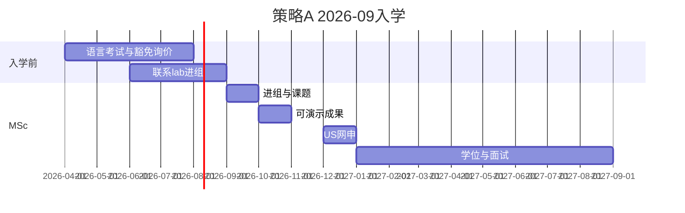

# 转美路径分析（审理产出，非执行令）

> **Owner 锁定：** 2026-09 入学 · 1 年 MSc · **策略 A（2027 Fall US PhD）** · 本科无科研、有嵌入式/自动化竞赛与项目。  
> 语言：见 [language_waiver_notes.md](language_waiver_notes.md)。

## 1. 你的方案在法庭里的评级

| 项 | 评估 |
|----|------|
| 策略 A + 2026-09 | **可行但高风险**（MODIFY 加强） |
| 本科无科研 | 申请时主要靠 **竞赛/项目 + 前 3–4 个月 MSc 研究**；顶校 funded **不宜作唯一目标** |
| 竞赛/嵌入式项目 | **有用**，须改写成「工程能力证据」，**不能**冒充论文级科研 |
| 语言 | 策略 A 下 **仍建议 2026 夏考 IELTS/TOEFL**；UoM 在读 **少数校**可能豁免，须逐校邮件确认 |

**总评：仍 RECOMMENDED_WITH_MODIFICATIONS**，并增加 **Plan B**：若 2026-10 仍未进组 → 自动降级为策略 B（2028 Fall）。

---

## 2. 策略 A 专属日历（2026-09 入学 → 2027 Fall PhD）

| 时间 | 动作 | 与语言/证据 |
|------|------|-------------|
| **2026-04 ~ 06** | 定 15–20 所 US 校；查 language policy；**考 IELTS/TOEFL** | 见 language_waiver_notes |
| **2026-06 ~ 08** | 列曼大 lab；**套瓷/邮件问进组**（抢 9 月 slot） | 用 1 页 proposal（robotics+agent） |
| **2026-09** | 入学；**第 1 个月内进组** | P1a 硬门槛 |
| **2026-10 ~ 11** | 可演示原型（仿真/嵌入式+agent 工具链） | 把本科竞赛写进 SOP「工程证据」 |
| **2026-12 ~ 2027-01** | **提交 US PhD 申请** | 语言分须已进系统（或校书面豁免） |
| **2027-01 ~ 08** | 继续 MSc 课题；面试；补材料 | 推荐信来自 **MSc 导师**（关键） |
| **2027-09** | MSc 毕业；若录取则衔接 PhD（或短 gap） | — |

---

## 3. 「入学前语言考掉」— 针对你的直接回答

**意思：** 在 **2026-09 前或最迟 2026-12 截止前** 有 **官方英语成绩**（或目标校 **书面豁免**）。

**能否不考、用 UoM 豁免？**

- **不能指望**「拿到曼大 offer / 在读」就自动免 TOEFL/IELTS。  
- **策略 A** 申请时学位**未完成**，多数学校仍要分数；**毕业后**（策略 B）用 UoM 学位申请 **豁免概率更高**。  
- **可做：** 对每所目标校问 waiver；有书面 OK 的校可不送分，其余校仍考。  
- 详情：[language_waiver_notes.md](language_waiver_notes.md)

---

## 4. 无本科科研时，竞赛/项目怎么用在转美叙事里

| 做法 | 说明 |
|------|------|
| SOP 里 1 段 | 竞赛/嵌入式：**问题定义 → 你的模块 → 可量化结果**（延迟、稳定性、名次） |
| 与 agent 衔接 | 例：嵌入式实时系统经验 → 支撑 **embodied / edge agent** 或 **sim-to-real** 叙事 |
| 不要写 | 「等同科研论文」「长期实验室经历」（会被 evidence_audit 扣分） |
| MSc 必须补 | **至少 1 段 3–4 个月可验证研究**（代码库 + 实验/仿真），否则策略 A 很难过线 |

**选校 tier 建议（定性）：** 以 **match + safe（funding 明确）** 为主；reach 少量且须强导师 match。

---

## 5. 套瓷 / 进组（2026 夏开始）

- **Owner 首选：** Chenghua Lin（曼大 **CS / NLP**）— 详情见 `inputs/pi_targets.md`；**套瓷信暂不撰写**。  
- **2026-06 起** 可联系（不必等开学）：目标 **9–10 月前有明确进组或合作**。  
- 叙事须 **桥接**：MSc **Robotics** × 其 **NLP/LLM/agent**（避免纯「我想做 agent」）。  
- 仍 **不替代** US 网申。

---

## 6. 翻转条件（你已选 A，须自检）

| 检查点 | 若未满足 |
|--------|----------|
| 2026-08 仍无语言分且无校书面豁免 | 推迟首申或改 B |
| 2026-10 未进组 | **放弃 A**，改 2028 Fall + RA |
| 2026-11 无演示级原型 | 降 tier；扩大 funded match 校 |

---

## 7. 法庭结论

路径 **值得走**；你选的 **短时间策略 A** 与 **无本科科研** 组合 → **必须** 执行「入学前语言 + 开学 1 月内进组 + 竞赛改工程证据」。  
UoM 学历 **不能默认** 替代语言考试；**并行豁免询价 + 一考保底** 最稳。

**待补：** 竞赛/项目清单（名称、角色、结果）→ 写入 `evidence_pack.md` 后可细化 SOP 要点。
