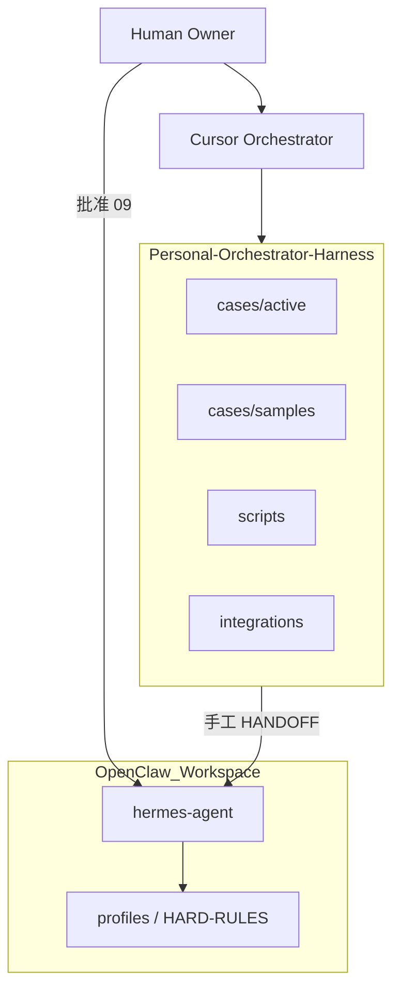

# Phase 3 Architecture

Phase 3 = **第一个真实 active 案件** + **集成文档化**。仍遵守 [constraints/HARNESS_ENGINE.md](../constraints/HARNESS_ENGINE.md) 第一阶段边界：不自动 API、不自动 Hermes。

## 系统边界

| 组件 | 路径 | 职责 |
|------|------|------|
| Harness | 本仓库 | 审理、授权四字段、任务书、验收、lessons 提案 |
| 金样例 | `cases/samples/CASE-001-*` | 只读参考全链路 |
| 活跃案 | `cases/active/CASE-*` | 真实决策进行中 |
| Hermes | `~/OpenClaw_Workspace/hermes` | External Executor（授权后） |
| MiMo 测试 | `docs/WORKFLOW_TEST_MIMO.md` | 工作流模型对齐，非自动调用 |

## Session 分离（硬规则）

| Session | 读什么 | 写什么 | 禁止 |
|---------|--------|--------|------|
| A 审理 | 00–02b、inputs、registry | 03–07、team_blocks、06 | `execution_authorized: true`（除非 Owner 当场批准） |
| B 执行 | 08、09、inputs | 10（Executor）、11（Orchestrator） | 扩大 scope、写 approved lessons |
| C 沉淀 | 11 | 12 → 审计 → `lessons/approved/` | Executor 直接改 SOUL/AGENTS |

## 可视化层（成品视图）

| 产物 | 生成方式 | 作用 |
|------|----------|------|
| `artifacts/CASE_DASHBOARD.html` | `scripts/render_case_dashboard.py` | 单案看板：链路、辩论、CAC、授权 |
| `cases/index.html` | `--index` | 全部 active/samples 入口 |
| `canvases/orchestrator-sop.canvas.tsx` | Cursor IDE | SOP 总览 + 可点击链路清单 |
| `docs/SOP_ONE_PAGE.md` | 文档 | 一页纸命令与流程 |

Markdown 仍是真源；HTML/Canvas 只读，修改案件后需重新生成看板。

## Phase 3 已交付（路线 A+B）

### 路线 A

- 案件：[cases/active/CASE-20260603-mems-phase2-resume-jd-match/](../cases/active/CASE-20260603-mems-phase2-resume-jd-match/)
- 状态：`instruction_issued`（Phase2 执行中）
- 授权：`execution_authorized: true`，`authorized_phase: phase2`
- 交接：`artifacts/HANDOFF_hermes_phase2.md`（手工交 Hermes）
- 证据：自 CASE-001 复制的 Phase1 池（mock），见 `inputs/case001_reference.md`

### 路线 B

- [integrations/hermes_handoff_checklist.md](../integrations/hermes_handoff_checklist.md)
- 本文件

## 脚本与阶段对应

| 阶段 | 脚本 |
|------|------|
| 立案 | `new_case.py --prepare` |
| 建议队/模式 | `suggest_teams.py`, `suggest_modes.py` |
| 块骨架 | `scaffold_team_blocks.py` |
| 进度 | `case_status.py` |
| 校验 | `validate_case.py` |
| 交接包 | `render_handoff.py`（仅授权后） |
| 回归 | `make smoke` |

## 明确不做（Phase 3 仍不做）

- 多模型 API 编排、自动跑法庭
- 自动 Hermes cron、改 Hermes 源码
- 飞书 / Obsidian 同步（占位保留）

## Owner 批准后下一步

1. 更新 `01`/`07`：`execution_authorized: true`, `authorized_phase: phase2`
2. 编写 `09_executor_instruction.md`
3. 按 [hermes_handoff_checklist.md](../integrations/hermes_handoff_checklist.md) 交接
4. 独立 `11` 验收后考虑 `completed` 与 lesson 升格
