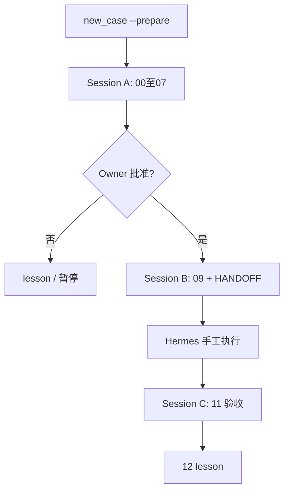

# SOP 一页纸 — Personal-Orchestrator-Harness

> **Owner 日常：** `make hub` + [OWNER_JOURNEY.md](OWNER_JOURNEY.md)；QQ 见 [integrations/qq_harness_bridge.md](../integrations/qq_harness_bridge.md)。

## 角色

| 角色 | 谁 | 做什么 |
|------|-----|--------|
| Owner | 你 | 批准执行、高风险点头 |
| Orchestrator | Cursor | 立案 → 法庭 → 07 → 验收 |
| External Executor | Hermes 等 | 仅按 `09` 执行 |

**硬规则：** `court_verdict_tier` **≠** `execution_authorized`

## 主流程

## 命令速查

| 目的 | 命令 |
|------|------|
| **日常入口** | `make hub` → http://127.0.0.1:8765 |
| **新案 / fork** | Hub 表单 或 `make start` / `make fork` |
| **QQ 查案** | `h cases` / `h status`（需 Hub + harness-owner skill） |
| **离线看板** | `make dashboard` / `cases/index.html` |
| **Hermes 体检** | `make hermes-doctor` / `make hermes-setup` |
| **法庭手册** | `make court-launch CASE=…` |
| **法庭自动** | `make court-run CASE=…` |
| **六阶 daemon** | `make workflow CASE=…` |
| 进度 / 校验 | `case_status.py` / `validate_case.py` |
| 回归 | `make smoke` |

## 讨论过程写在哪？

1. **`03_debate_session.md`** — 冲突表 + **讨论纪要**（必填）
2. **`artifacts/team_blocks/*.md`** — 各队 Findings / Conflicts
3. **看板** — 聚合展示上述内容（`render_case_dashboard.py`）

## 可视化成品

| 产物 | 用途 |
|------|------|
| [CASE_DASHBOARD.html](../cases/active/) | 单案 HTML 看板（真源再生） |
| [cases/index.html](../cases/index.html) | 全部案件入口 |
| [Orchestrator SOP Canvas](file:///Users/openclaw/.cursor/projects/Users-openclaw-Personal-Orchestrator-Harness/canvases/orchestrator-sop.canvas.tsx) | IDE 内 SOP 总览 |

## 深入阅读

- [ORCHESTRATOR_RUNBOOK.md](../engine/ORCHESTRATOR_RUNBOOK.md)
- [PHASE2_USAGE.md](PHASE2_USAGE.md)
- [PHASE3_ARCHITECTURE.md](PHASE3_ARCHITECTURE.md)
- [PHASE4_INTERACTIVE_SOP.md](PHASE4_INTERACTIVE_SOP.md)
- [PHASE5_AUTOMATION.md](PHASE5_AUTOMATION.md)
- [OWNER_JOURNEY.md](OWNER_JOURNEY.md)
