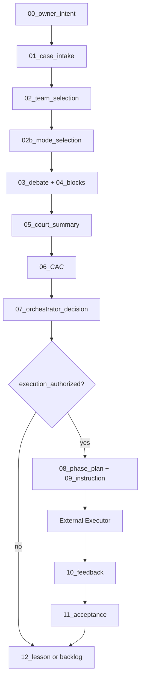

# Orchestrator Runbook

**执行者：Cursor（默认 Orchestrator）**  
**非执行场景：** 仅当任务为更新本 Harness 仓库文档/模板时，Cursor 临时充当 Local Executor。

---

## 流程图（辅助）



---

## 纯文本步骤（主流程，必须按序）

### Phase A — 审理（通常 Session 1，新上下文）

| 步 | 动作 | 产物 | 完成条件 |
|----|------|------|----------|
| A1 | 记录用户原话，不改写为结论 | `00_owner_intent.md` | 有原文或忠实摘要 |
| A2 | 立案：类型、风险、四字段授权状态 | `01_case_intake.md` | frontmatter 完整；`execution_authorized` 默认 false |
| A3 | 用 `registry/team_selector_rules.yaml` 选队并**写理由** | `02_team_selection.md` | 列出选用与**未选用**团队 |
| A4 | 用 `registry/mode_selector_rules.yaml` 选模式并**写理由** | `02b_mode_selection.md` | 模式有序列表 + 时间成本说明 |
| A5 | 按 `prompts/court/*.md` 壳调用各 team，填统一块 | `artifacts/team_blocks/<team_id>.md` | 每队符合 `templates/04` |
| A6 | 汇总法庭，**不得**在此文件写执行命令 | `05_court_summary.md` | `court_verdict_tier` 五档之一 |
| A7 | 若触发 CAC 规则，填写前提与翻转条件 | `06_critical_assumption_check.md` | 每条前提有验证方式 |
| A8 | 采纳/部分采纳/驳回；更新授权四字段 | `07_orchestrator_decision.md` | 明确 `execution_authorized` 与 `authorized_phase` |

**CAC 强制触发：** `risk_tier >= high` 或 `court_verdict_tier` ∈ {RECOMMENDED, RECOMMENDED_WITH_MODIFICATIONS, IMMEDIATELY_RECOMMENDED}。

### Phase B — 执行（新 Session，只读 08/09 + 输入）

| 步 | 动作 | 产物 | 完成条件 |
|----|------|------|----------|
| B0 | Owner 批准（若 `human_approval_required`） | 更新 `01`/`07` frontmatter | `execution_authorized: true` |
| B1 | 拆 Phase，每 Phase 独立文件 | `08_phase_plan.md` | Phase 边界清晰 |
| B2 | 写 External Executor 任务书 | `09_executor_instruction.md` | 含禁止项、验收、停止条件 |
| B3 | **手工**交给 Hermes/OpenClaw，**不**自动调度 | （外部日志） | 不修改 Hermes 源码 |
| B4 | 收集 Executor 自报 | `10_execution_feedback.md` | 仅事实与路径 |
| B5 | **独立验收**（不信 10） | `11_acceptance_review.md` | 逐项 checklist |

### Phase C — 沉淀

| 步 | 动作 | 产物 | 完成条件 |
|----|------|------|----------|
| C1 | 起草 lesson，标是否升格 | `12_lesson_proposal.md` | `promote_to_*` 字段齐全 |
| C2 | Orchestrator 审计后移动 | `lessons/approved/` 或保持 pending | 无 Executor 直写 |

### 结案

- `status: completed` **仅当** `AGENTS.md` 可审计链路 12 环节均满足（无执行案件：9 为 explicit false，跳过 10–11 须在 `01` 说明）。
- 缺环节 → `status: blocked` + 注明缺什么。

---

## 可审计链路（与 AGENTS.md 一致）

```
原始意图 → 案件定义 → 团队选择理由 → 模式选择理由 → 团队评审块
→ 汇总 verdict → 关键前提检查 → Orchestrator 决策 → 执行授权状态
→ 执行任务书 → 验收结果 → lesson proposal
```

**禁止跳步。** 禁止在未完成 06 时因 verdict 好看直接写 09。

---

## Verdict 与执行授权（再次强调）

| court_verdict_tier | 能否进入 Phase B | execution_authorized 默认值 |
|--------------------|------------------|-------------------------------|
| REJECT | 否 | false |
| MODIFY | 否（先改案再审） | false |
| RECOMMENDED_WITH_MODIFICATIONS | 仅验证性子任务 | false，待 06 验证 |
| RECOMMENDED | 可规划 Phase，常需 Owner | false，待 07/Owner |
| IMMEDIATELY_RECOMMENDED | 仍须 07 + Gate | false，直到显式授权 |

---

## 上下文隔离

- 审理与执行**不同 Cursor 会话**（见 `engine/phase_isolation.md`）。
- 每 Phase 一份 `09_executor_instruction_phaseN.md` 或子目录 `phases/phaseN/`。

---

## 第一版工具

- 团队/模式：读 `registry/*.yaml`，人工应用规则。
- 提示：仅用 `prompts/` 最小壳 + `registry/teams/*.yaml`。
- 不接 API，不自动 Hermes。
