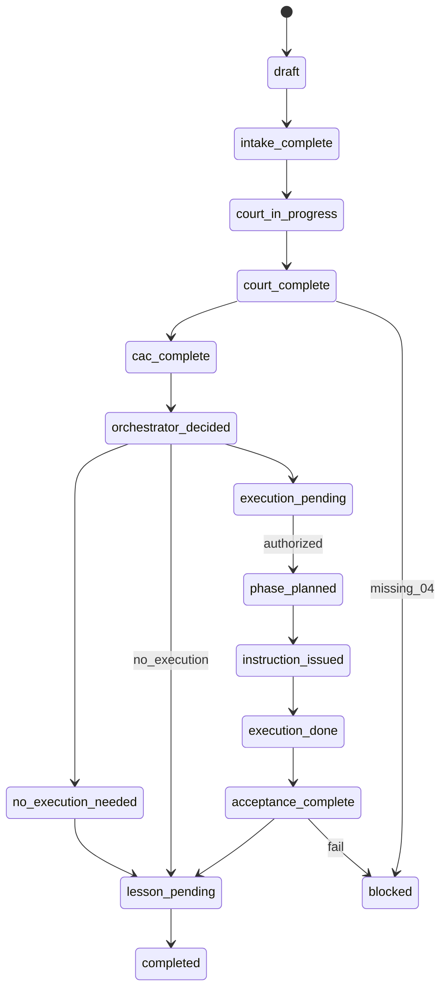

# Case Lifecycle

## 状态机（纯文本）

```
draft → intake_complete → court_in_progress → court_complete
  → cac_complete → orchestrator_decided
  → [execution_pending | no_execution_needed]
  → phase_planned → instruction_issued → execution_done
  → acceptance_complete → lesson_pending → completed | blocked
```

### 状态说明

| 状态 | 含义 | 进入条件 |
|------|------|----------|
| `draft` | 仅有 topic | 创建 case 目录 |
| `intake_complete` | 01 填完 | frontmatter 校验通过 |
| `court_in_progress` | 辩论进行中 | 02/02b 完成，至少一个 04 块 |
| `court_complete` | 05 已汇总 | 所有选用 team 有 04 |
| `cac_complete` | 06 完成或豁免 | 见 CAC 规则 |
| `orchestrator_decided` | 07 完成 | 授权四字段已更新 |
| `execution_pending` | 需要但未授权执行 | `needs_execution:true` 且 `execution_authorized:false` |
| `no_execution_needed` | 纯决策案件 | `needs_execution:false` |
| `phase_planned` | 08 完成 | — |
| `instruction_issued` | 09 已交付 Executor | `execution_authorized:true` |
| `execution_done` | 10 已提交 | — |
| `acceptance_complete` | 11 完成 | Orchestrator 签署 |
| `lesson_pending` | 12 草稿 | — |
| `completed` | 全链路满足 | 见 AGENTS.md |
| `blocked` | 缺环节或验收失败 | 注明原因 |

## CAC 豁免（须在 01 注明 `cac_exempt_reason`）

- 仅当 `court_verdict_tier: REJECT` 且 `risk_tier: low` 时可豁免 06。
- `critical_assumption` 团队仍可在 02 中选用用于记录，但 06 可标 `waived`。

## 状态图（辅助）


